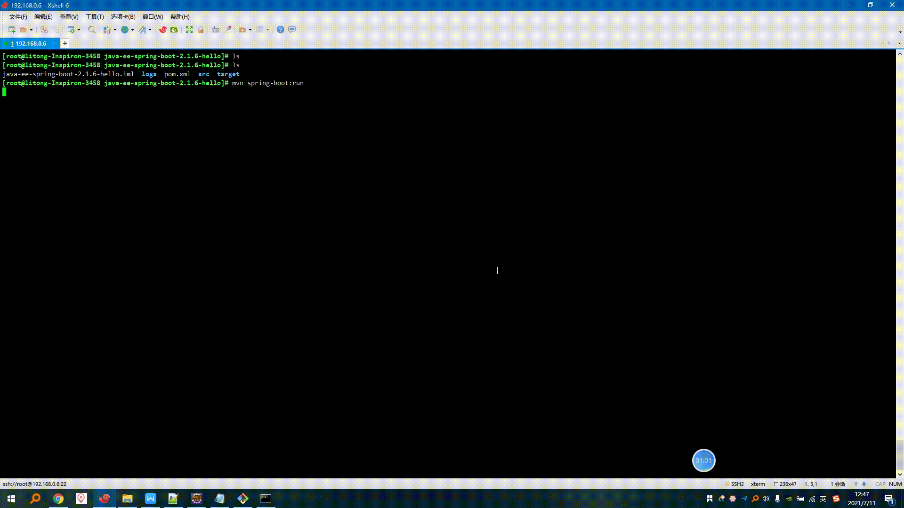

# litongjava-dev-tools-file-sync

## 简介

[主要功能]  
1.检测目录下的文件是否有变化,如果有变化通过ssh协议上传到linux  
 
[替代产品]  
idea的Tools-->Deployment  

[软件架构]  
jfinal+sqllite   

[用途]  
检测到编译后的class文件变动,将class文件上传到linux服务器,linux服务器使用HotSwapWatcher检测的class文件变动会自动重启服务.实现在windows上编写代码,在linux上运行  

## 使用
下载release中的文件  
在windows启动start.bat  
启动成功后访问http://127.0.0.1:10037/dev-tools-file-sync/
配置同步信息  
  

| 参数     | 简介                                                         |
| -------- | ------------------------------------------------------------ |
| 本地路径 | E:\dev_workspace\java\java-study\java-ee-spring-boot-study\java-ee-spring-boot-2.1.6-study本地工程目录 |
| 远程路径 | 上传位置/root/dev_workspace/java/java-study/java-ee-spring-boot-study/java-ee-spring-boot-2.1.6-study |
| 远程IP   | 远程服务器IP                                                 |
| 用户名   | 服务器ssh用户名                                              |
| 密码     | 服务器ssh密码                                                |
| 端口     | 服务器ssh端口                                                |

配置完成后点击同步文件

文件同步成功后开启服务

内存消耗为113MB

## 测试视频
https://www.bilibili.com/video/bv1Uw411R7aS

配置同步信息  
  

